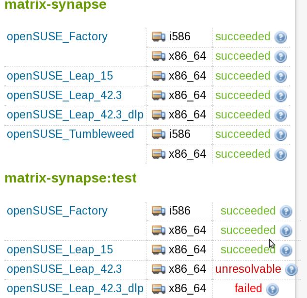

## Motivation

* What if upstream tests are passing but your package is broken?
* What if openQA system tests are too late or too broad?

''Example project:''
https://build.opensuse.org/package/show/network:messaging:matrix/matrix-synapse

---

## What do you need?

Two files:

* _multibuild

```yaml
<multibuild>
    <package>test</package>
</multibuild>
```

---

## … and <package>.spec

```yaml
%if "@BUILD_FLAVOR@" == ""
%define _test 0
…
%endif

Name:           %{short_name}%{?name_ext}
…
%if 0%{?_test}
BuildRequires:  %{short_name}
%else
BuildRequires:  %{python_module base}
Requires:       python-bcrypt
…

%build
%if 0%{?_test}
synctl start
register_new_matrix_user --config homeserver.yaml --user opensuse --password opensuse --admin https://localhost:8448
%else
%python_build
```

---

## build + test results



---

## … and <package>.spec

… and some boiler plate
```yaml
(another 20 ugly lines of %if/%else in the spec file)
```

---

## not all people like that


ideas for improvements?

